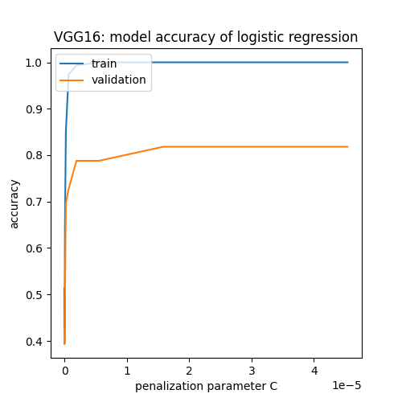
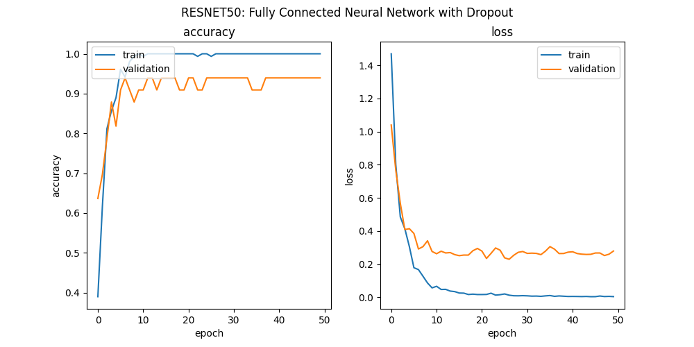

# Classification Transfer Learning

This project was created in the context of the elective module 'Learning from Images' under the supervision of [Prof Dr Kristian Hildebrand](https://projekt.bht-berlin.de/data-science/principial-investigators/kristian-hildebrand/) at the [Berliner Hochschule für Technik (BHT)](https://www.bht-berlin.de/). 
The aim was to compare different supervised classification algorithms using feature extraction at different stages of different Transfer Learning Neural Networks, which were trained on the [ImageNet Dataset (ILSVRC)](https://www.image-net.org/challenges/LSVRC/index.php)

## Table of Contents

## Goal

The goal of this work was to get some practical experience and insight into Transfer Learning and its ecosystems. 

Questions to be answered were:
1. How well do different comparatively default Image Transfer Learning Neural Networks perform on a different task? 
2. How well do those Neural Networks perform being cut off at different stages?
3. What's the practicality of Transfer Learning on ordinary image classification tasks?
4. Which multiclass classification algorithm performs best on the features being put out by the different Transfer Learning Networks?

## Dataset

### Dataset of the Transfer Learning Neural Networks

The dataset on which the Transfer Learning Neural Networks are trained is a subset of the [ImageNet Large Scale Visual Recognition Challenge (ILSVRC) Dataset](https://www.image-net.org/download.php) which consists of 1000 classes of objects / entities in pictures, consisting of over 1 Mio training images, 50,000 validation images and 100,000 test images [[1]](#references-1). 

ImageNet was chosen as the domain of the Transfer Learning Neural Networks because of the breadth and quantity of motives as well as the high academic interest in it [[2]](#references-2), signalling a tried approach and the validity of the effort.

<!-- trust?
 -->

### Dataset for the Classification Task

The dataset consists of a curated set of pictures current and former Presidents of the United States (POTUS): Joe Biden, Donald Trump and Barack Obama.

The dataset has been chosen upon consideration of internal comparability of the different classes (background of POTUSES tend to display the American flag), use of different kinds of cameras and angles as well as different lightning. 

The pictures are resembling in a more or less brusque fashion a portrait of the respective POTUS.

Images were gotten via a [Google Image Downloader](https://github.com/hardikvasa/google-images-download), whereby the API complicated getting the hands on thousands of pictures on each class. Therefore subsequently, the project has been reformulated as a comparison of the use of Transfer Learning Neural Networks and stacked algorithms on a few shot learning problem. The API works by automatically downloading the first entries of a Google Image search query. 

The images were later manually curated based on the content of the pictures (Google Image Search in ~10-20% of cases did not yield good results) in terms of a 'portrait fit' of the respective POTUS as well as a comparative dimension of the pictures. 

The image dataset in the end comprises an unbalanced dataset with the following quantities

| Class | Instances |
| ----------- | ----------- |
| Biden | 70 |
| Trump | 80 |
| Obama | 65 |

The dataset was split into a training, validation and test dataset with the respective share of 70, 15, 15 percent of the whole dataset. 

<!-- comment default. I don't have much to say here, due to lack of specifications of how to get the Imagenet weights? Do some picture here?
 -->

## Design and Algorithms

### Preprocessing

Preprocessing was not considered the focus of this work: images of POTUSes have different dimensions, but gross differences were eliminated via the curation process. Adjustment of the dimension was achieved by squeezing the pictures with a subsequent subtraction of the mean of every color channel with respect of the ImageNet dataset with a subsequent change of the image color space from RGB to BGR.

### Transfer Learning Neural Networks

As Transfer Learning Neural Networks, VGG16 [[3]](#references-3), ResNet-50 [[4]](#references-4) and InceptionV3 [[5]](#references-5) were used. The choice of these networks were based on a historical good performance on the ILSVRC contests, computational performance as well as ease of use via the Keras library. 

For all Transfer Learning Neural Networks, the last dense layers were cut off and the output of the last remaining layer is used as features / as input for the subsequently explained Classifiers. 

VGG16 was also cut off after the 4th block (instead of after the 5th block) of which the last element is the max pooling layer (the 4th max pooling layer of the network), subsequently referred to as the 'VGG16block4pool' model. 

Due to computational limits, the output of the application of the adjusted Transfer Learning Neural Networks on the POTUS dataset was stored locally in order to speed up the subsequent application of different Classifiers on those features.

### Classifiers

As Classifiers were used: Logistic Regression, a Support Vector Classifier a self-built Convolutional Neural Network as well as a Fully Connected Neural Network. 

For the former two Classifiers, ~20 different instances of different architectures for Neural Networks were tried out, but the to-be-presented were chosen based on explainability, computational performance and comparative performance (among 'peers'). 

1. a convolutional Neural Network consisting of 2 convolutional layers with a respective max pooling layer afterwards, followed by one dense layer with 64 nodes, before reducing it to 3 nodes, mirroring the multiclass classification problem.
2. a fully connected Neural Network, just consisting of a dropout layer with 100 nodes, followed up to the aforementioned 3 node layer. 

### Tuning

Hyperparameters were tuned for every combination of Classifier and Transfer Learning Neural Networks on the specified validation set. The results were calculated on the specified test set. 

<!-- to do here:
network pics einfügen? 

choice of hyperparams for the SVM and for Logistic Regression? kurz die commands googeln dafür 
 -->

### Implementation

For implementing the neural networks, the Framework [Keras](https://keras.io/) has been used. The other other classifiers were adjusted, using the library [scikit-learn](https://scikit-learn.org/stable/). The implementation of the feature extraction as well as application of Classifiers as largely followed [[6]](#references-6). Though the implementation of the SVC has followed [[7]](#references-7), implementation of the models has largely followed the vanilla API description in [[8]](#references-8). 

## Results

The results should be interpreted within the baseline: a random guess having  an accuracy of 1/3 for a 3-class classification problem.

### Logistic Regression
Applying Logistic Regression on the output of the different Transfer Learning Neural Networks gives a consistent picture:
No matter the applied Neural Network, Logistic Regression tends to perform best with the choice of the penalization parameter C that leads Logistic Regression to totally overfit to the training data, caricaturing the use of the penalization parameter. 

| Transfer Learning Neural Network | Test Set Accuracy |
|--------------|----------------------------------|
| VGG-16 | .6875                        |
| VGG-16 (block4pool)| .625                          |
| InceptionV3 | .594                            |
| ResNet50 | .75                   |

### Support Vector Classifier
The results of the Support Vector Classifier (SVC) are similar to the Logistic Regression: adjustment of the budget of the Classifiers was best with total overfitting to the test data. 

| Transfer Learning Neural Network | Test Set Accuracy |
|--------------|----------------------------------|
| VGG-16 | .75                        |
| VGG-16 (block4pool)| .594                          |
| InceptionV3 | .545                            |
| ResNet50 | .75                   |

### Convolutional Neural Network

Results using the Convolutional Neural Network on the features did see an increase of accuracy via training on different epochs of the dataset, but had on average a worse accuracy than the two aforementioned Classifiers. Notably, this is the only Classifier, where VGG16block4pool performs best on.

| Transfer Learning Neural Network | Test Set Accuracy |
|--------------|----------------------------------|
| VGG-16 | .5                        |
| VGG-16 (block4pool)| .62                         |
| InceptionV3 | .5625                            |
| ResNet50 | .437                   |

### Fully Conntected Neural Network

The results of applying the Fully Connected Neural Network are best, except for the feature output from the InceptionV3 Transfer Learning model, with validation accuracy percentages in the 90s and Test accuracy percentages in the 80s.

| Transfer Learning Neural Network | Test Set Accuracy |
|--------------|----------------------------------|
| VGG-16 | .843                        |
| VGG-16 (block4pool)| .781                         |
| InceptionV3 | .406                            |
| ResNet50 | .875                   |

<!-- what more / different to tell here than your slides?
time needed? Or just give text to the different networks?

 Overall: execution time was not explicitly measured, but 

 F1 scores? -- wouldn't have been a problem!

 Random Forest?

 -->

## Discussion and Outlook

### Discussion
The different results of the Classifiers yield some questions: 
why the 3 categories of the results?
First of all about the Logistic Regression and the SVM, returning similar results: both are machine learning models mostly using linear combinations of features to generate the output, lacking the functionality of interactions between the features. This could explain the comparative results of both methods.

The results of the Convolutional Neural Network surprised a bit given the adaptive nature of neural networks, combining both linear combinations and interactions. It is remarkable, that the Convolutional Neural Network performs best on the VGG16block4pool model, where 1 block of convolutions is missing out in comparison to the VGG-16 model. However, especially in comparison to the other neural network, accuracy is still meagre.

The comparatively good results of the simple Fully Connected Neural Network could be explained by the design of the Transfer Learning Process used in this task: cutting off the last dense layers of the Transfer Learning Networks, the output of those modified Networks are probably optimized for the architecture of neural networks. Independent from their inherent capability of combining both linear combinations and interactions, which stand out in comparison to the two first used Classifiers.

In general, the task of separating the last 3 POTUSes should not be too hard, because at the very least because of the different skin colors of the POTUSes (white, tangerine, black), the different hair colors (white, yellow, black / grey) and the different hairstyles.

The stage at which Transfer Learning Neural Networks should be cut off is an important variable. Results of the Classifiers are consistently better for the later stage of cutoff of the VGG-16 model, except for the Convolutional Neural Network, as stated above. This supports the idea of using a large part of the Transfer Learning Networks at late stages for this kind of classification task in comparison to other shapes - e.g. a task of classifying different pieces of art of Impressionism. 

However, this is not a must: when training with much more pictures of the respective POTUSes and orders of magnitude more computational power, using the last stages of Transfer Learning Neural Networks could actually yield negative Transfer Learning results in comparison to more previous ones. 

### Future Work

There are lots of areas for further refinement and improvement:

1) the dataset: orders of magnitude more data, balancing of the class distribution of the data, better solving the problem of different dimensions of the pictures - either by using object detection or face detection and adjusting based on that, or hand curation.
2) preprocessing: rescaling and turning of the images
3) a broader search of hyperparameters for the different Classifiers as well as depth of cutting off the Transfer Learning Neural Networks
4) using cross-validation instead of the clear cut train/validation split. This has not been done because of computational reasons, but would probably help the hyperparameter abnormalities of Logistic Regression and SVC.
5) retraining of the last dense layers of the Transfer Learning Neural Networks. This would probably only make sense by adding one last layer consisting of 3 nodes to the last layer of the Transfer Learning Neural Networks, consisting of 1000 nodes. Translated into the transfer learning process used by this project, this would mean a different initialization and different architecture of the neural network Classifiers. Retraining could also be extended with different degree of depth into the non-fully connected layers in the Transfer Learning Neural Networks.

<!-- to do here:
beantworte deine Goal questions (auch mithilfe von Results)

wow; training with starting points of the network? (initialization?) -- but that's not really possible here (except if you add 1 layer to it (reducing it to 3 nodes?))
 -->

## Conclusions

There is no pareto efficient Classifier with regard to accuracy on each method, but the Fully Connected Neural Network works best by far on 3 of the 4 chosen Transfer Learning Neural Networks for feature generation. Especially on few shot learning problems, Transfer Learning Networks together with a Classifier perform comparatively well, achieving ~87% accuracy on the test set, within the bounds of computational power of a mid-range 2015 laptop. 
For this kind of classification task (portraits of humans), with the small size of the dataset and the computational power available: being cut off at a late stage works best with Transfer Learning Neural Networks

## References

[1] https://www.image-net.org/download.php

[2] https://scholar.google.com/scholar?hl=en&as_sdt=0%2C5&q=ilsvrc&btnG=

[3] https://arxiv.org/abs/1409.1556v6

[4] https://arxiv.org/abs/1512.03385v1

[5] https://arxiv.org/abs/1512.00567v3

[6]
https://appliedmachinelearning.blog/2019/07/29/transfer-learning-using-feature-extraction-from-trained-models-food-images-classification/ 

[7] https://www.datatechnotes.com/2020/07/classification-example-with-linearsvm-in-python.html 

[8] https://scikit-learn.org/stable/

<!-- to do here:

Images of results
architectures of the different networks?

Be fast and efficient now. It's really about number of words now. 

Imagenet Dataset anders machen?

Table of contents?

 -->

 <!-- comment default
 -->
